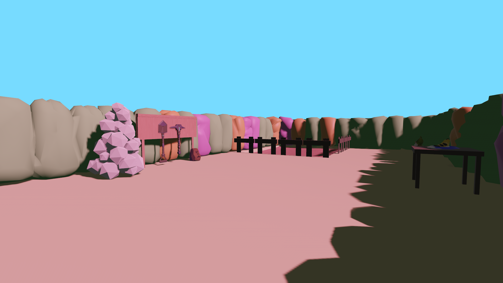

# Pilot Garden

Pilot Garden is a 3D minigame.

> [!CAUTION]
> The source code and the file names of the source code may contain major spoilers.



## Sytem requirements

A `GeForce GTX 1050 Mobile` with 2GiB of vRAM works.


## Installation (compiling from source)

The first step is to [install Rust](https://rust-lang.org/tools/install/):

```bash
# Unix-like OS, click on the "install Rust" link if you're running on Windows
curl --proto '=https' --tlsv1.2 -sSf https://sh.rustup.rs | sh
```

After cloning this repository, it can be run in the browser with
[cargo](https://doc.rust-lang.org/cargo/guide/creating-a-new-project.html):

```bash
git clone https://github.com/carrascomj/pilot_garden.git
cd pilot_garden
# this will take a while, depending on the number of CPU cores
cargo run --release
```

This may possibly require extra dependencies. Check the [bevy setup page](https://bevy.org/learn/quick-start/getting-started/setup/).

## License

### Source Code

Copyright 2026 Jorge Carrasco Muriel.

All source code in this repository, including shader code under `assets/`,
is licensed under either of:

- Apache License, Version 2.0, ([LICENSE-APACHE](LICENSE-APACHE) or http://www.apache.org/licenses/LICENSE-2.0)
- MIT license ([LICENSE-MIT](LICENSE-MIT) or http://opensource.org/licenses/MIT)

at your option.


### Assets (Non-Code)

Copyright 2026 Jorge Carrasco Muriel.

All assets located under the `assets/` directory, except for shader source code
and the fonts, are licensed under the Creative Commons Attribution-NonCommercial
4.0 International License (CC BY-NC 4.0).

You may obtain a copy of the license at:
https://creativecommons.org/licenses/by-nc/4.0/

These assets may not be used for commercial purposes.

### Contribution

Unless you explicitly state otherwise, any contribution intentionally submitted
for inclusion in the work by you, as defined in the Apache-2.0 license, shall be
dual licensed as above (MIT OR Apache-2.0), without any additional terms or
conditions.
